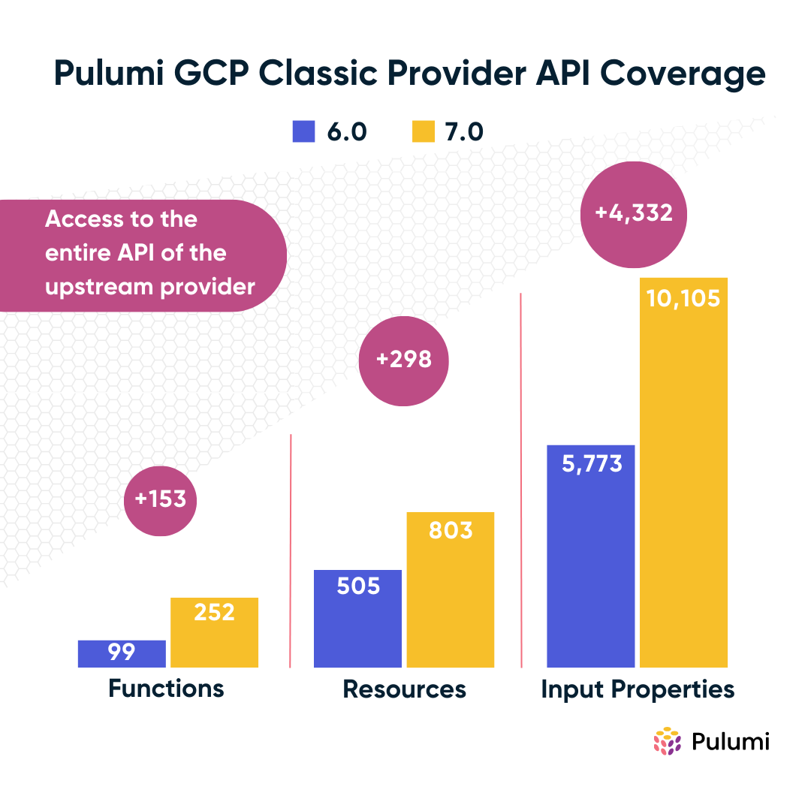

The latest major release of the Pulumi Google Cloud Classic Provider is available now! This [7.0 release](https://github.com/pulumi/pulumi-gcp/releases/tag/v7.0.0) contains the latest upstream changes to keep you up-to-date along with a highly requested bug fix, keeping your journey in managing Google Cloud resources fresh and smooth.

The Pulumi Google Cloud Classic provider can be used to provision any of the cloud resources available in the upstream provider. It is part of the suite of [Pulumi official providers](https://www.pulumi.com/docs/intro/cloud-providers/), which means that it is officially maintained and supported by Pulumi. The provider is also open source and available on [GitHub](https://github.com/pulumi/pulumi-gcp) for you to contribute and grow.

<!--more-->

If you are new to Pulumi and would like to get started with the Google Cloud provider, visit any of these pages to jump right in!

- [Getting Started](https://www.pulumi.com/docs/clouds/gcp/get-started/) - A guided walkthrough for creating your first project
- [Setup & Install](https://www.pulumi.com/registry/packages/gcp/installation-configuration/) - Instructions on installing the Google Cloud provider
- [How-to guides](https://www.pulumi.com/registry/packages/gcp/how-to-guides/) - Learn how to use the Google Cloud provider to provision specific resources
- [Templates](https://www.pulumi.com/templates/serverless-application/gcp/) - Use a quickstart template to create a new project
- [Pulumi AI](https://www.pulumi.com/ai) - Ask Pulumi AI to create a new project

## Looking back

Since the initial launch of 6.0 almost two years ago, we've shipped over 70 releases to deliver the latest upstream enhancements while also adding many of our own. Here are some of the highlights from these releases:

### Coverage and Growth

The Google Cloud provider now supports 250+ functions, 800+ resources, 10,000+ input properties. It continues to grow in coverage and features while staying up-to-date with the latest upstream changes. The chart below shows the growth of the provider in the last 2 years.



### New Modules

Version 6.0 of the Google Cloud provider introduced support for several new modules, including:

- [Alloy DB](https://www.pulumi.com/registry/packages/gcp/api-docs/alloydb/)
- [Assured Workloads](https://www.pulumi.com/registry/packages/gcp/api-docs/assuredworkloads/)
- [Backup Disaster Recovery](https://www.pulumi.com/registry/packages/gcp/api-docs/backupdisasterrecovery/)
- [BeyondCorp](https://www.pulumi.com/registry/packages/gcp/api-docs/beyondcorp/)
- [BigLake](https://www.pulumi.com/registry/packages/gcp/api-docs/biglake/)
- [BigQuery Analytics Hub](https://www.pulumi.com/registry/packages/gcp/api-docs/bigqueryanalyticshub/)
- [Certificate Manager](https://www.pulumi.com/registry/packages/gcp/api-docs/certificatemanager/)
- [Cloud Deploy](https://www.pulumi.com/registry/packages/gcp/api-docs/clouddeploy/)
- [Cloud IDS](https://www.pulumi.com/registry/packages/gcp/api-docs/cloudids/)
- [Database Migration Service](https://www.pulumi.com/registry/packages/gcp/api-docs/databasemigrationservice/)
- [Dataflow](https://www.pulumi.com/registry/packages/gcp/api-docs/dataflow/)
- [Dataform](https://www.pulumi.com/registry/packages/gcp/api-docs/dataform/)
- [DataPlex](https://www.pulumi.com/registry/packages/gcp/api-docs/dataplex/)
- [Datastream](https://www.pulumi.com/registry/packages/gcp/api-docs/datastream/)
- [Edge Network](https://www.pulumi.com/registry/packages/gcp/api-docs/edgenetwork/)
- [GKE Backup](https://www.pulumi.com/registry/packages/gcp/api-docs/gkebackup/)
- [GKE On-Prem](https://www.pulumi.com/registry/packages/gcp/api-docs/gkeonprem/)
- [Looker](https://www.pulumi.com/registry/packages/gcp/api-docs/looker/)
- [Network Connectivity](https://www.pulumi.com/registry/packages/gcp/api-docs/networkconnectivity/)
- [Network Security](https://www.pulumi.com/registry/packages/gcp/api-docs/networksecurity/)
- [Network Services](https://www.pulumi.com/registry/packages/gcp/api-docs/networkservices/)
- [VMware Engine](https://www.pulumi.com/registry/packages/gcp/api-docs/vmwareengine/)
- [Workstations](https://www.pulumi.com/registry/packages/gcp/api-docs/workstations/)

If you haven't used these modules yet, now is a great time to try them out! Check out the [Pulumi Registry](https://www.pulumi.com/registry/packages/gcp/) for more information on how to get started or ask [Pulumi AI](https://www.pulumi.com/ai) to create a new project for you.

## What's New in 7.0

### Service Account Rename

This release includes a fix for the [naming of the Service Account resource](https://github.com/pulumi/pulumi-gcp/issues/722). For consistency and ease of use, `serviceAccount` has been renamed to `serviceaccount`. Node.js, Python, and .Net programs do not require any updates as the resource name has been aliased. However updates are required for Go, Java, and YAML to adjust the import paths and resource type.



{}

```diff
- import "github.com/pulumi/pulumi-gcp/sdk/v6/go/gcp/serviceAccount"
+ import "github.com/pulumi/pulumi-gcp/sdk/v7/go/gcp/serviceaccount"
```

{}

{}

```diff
- import com.pulumi.gcp.serviceAccount.*;
+ import com.pulumi.gcp.serviceaccount.*;
```

{}

{}

```diff
- type: gcp:serviceAccount:Account
+ type: gcp:serviceaccount:Account
```

{}



### Labels Rework

Upstream changes for provider, resource, and data source labels are included in this release. Global Google Cloud Platform labels configured on the provider are supported through the new `defaultLabels` field. Default labels will be applied to all resources with a `labels` field.
Resources that previously contained a single `labels`  field will now contain three fields:

- The `labels`  field is now non-authoritative and only manages the label keys defined in your configuration for the resource.
- The output-only `pulumiLabels` field merges the labels defined in the resource's labels field and the global `defaultLabels`. If the same label key exists on both the resource level and provider level, the value on the resource will override the provider-level default.
- The output-only `effectiveLabels` will list all the labels present on the resource in GCP, including labels configured through Pulumi.

Due to the two new output fields, a resource that has a `labels` field may show a diff when upgrading from pulumi-gcp v6 to v7. This diff reflects adding the new resource Output fields and is safe to do.

You can find more information about this change in the [upstream documentation](https://registry.terraform.io/providers/hashicorp/google/latest/docs/guides/version_5_upgrade#provider-level-labels-rework).

## Upgrading

Upgrading from the previous version of the Google Cloud provider is straightforward. Simply update the version in your dependency manifest file, install the new package based on your language and package manager, then run `pulumi up` to migrate your existing stack. For Go programs, you will need to update specific imports within your program as well. This information is also available in our [migration guide](https://www.pulumi.com/registry/packages/gcp/how-to-guides/7-0-migration) in the Pulumi Registry.



{}

```diff
- "@pulumi/gcp": "^6.0.0"
+ "@pulumi/gcp": "^7.0.0"
```

{}

{}

```diff
- pulumi_gcp>=6.0.0,<7.0.0
+ pulumi_gcp>=7.0.0,<8.0.0
```

{}

{}

```diff
- require github.com/pulumi/pulumi-gcp/sdk/v6/go/pulumi v6.0.0
+ require github.com/pulumi/pulumi-gcp/sdk/v7/go/pulumi v7.0.0
```

{}

{}

```diff
- <PackageReference Include="Pulumi.Gcp" Version="6.*" />
+ <PackageReference Include="Pulumi.Gcp" Version="7.*" />
```

{}

{}

```diff
- com.pulumi:pulumi-gcp:6.0.0
+ com.pulumi:pulumi-gcp:7.0.0
```

{}



## Wrapping Up

As always, we welcome your feedback and contributions in the [Pulumi Community Slack](https://slack.pulumi.com/), [GitHub repository](https://github.com/pulumi/pulumi-gcp), and [Pulumi Community Discussions](https://github.com/pulumi/pulumi/discussions).

New to Pulumi? Signing up is easy and free. [Get started today](https://app.pulumi.com/signup)!

Happy coding!
